# グルメサーチアプリ

- 使用言語：Kotlin 1.4.30
- フレームワーク：Android Studio 4.1.2
- ライブラリ・API：Data Binding・ViewModel・LiveData・Coroutine・Retrofit2・Gson・Glide・RecyclerView・welcome-android

## 概要
ホットペッパーAPIを利用して周辺のレストランを検索するアプリです。

## 使用上の注意
ホットペッパーAPIを使用するため、APIキーが必要となります。

## WebAPI
使用したWebAPIを以下に示します。
 ホットペッパーグルメサーチAPI：https://webservice.recruit.co.jp/doc/hotpepper/reference.html

## 使用方法及び各画面の詳細

### 1. チュートリアル
アプリを起動すると、ウォークスルーが表示されます。
 ウォークスルーはプログラム内で常に表示するか、初回のみにするかを選択できます。
 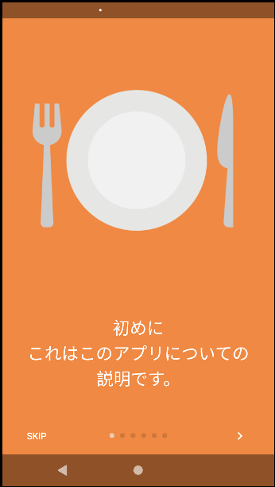
&emsp;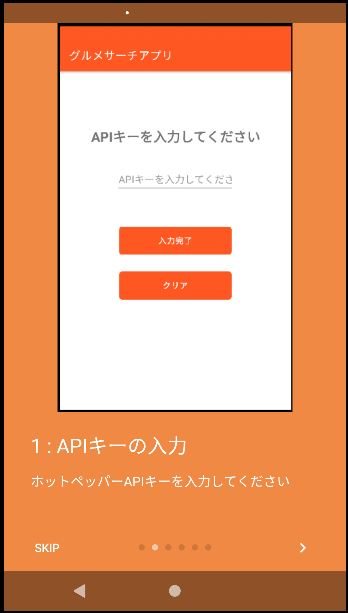
&emsp;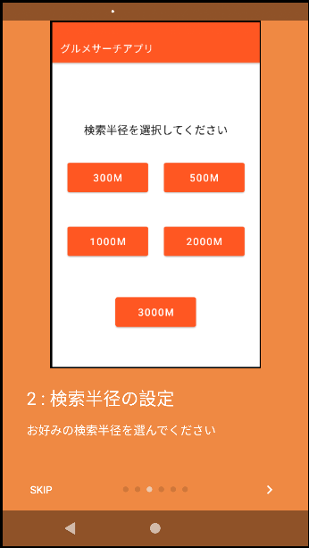
&emsp;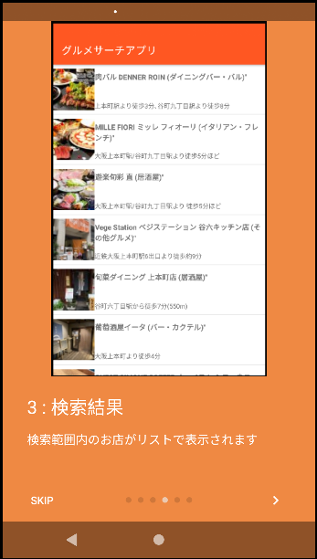
&emsp;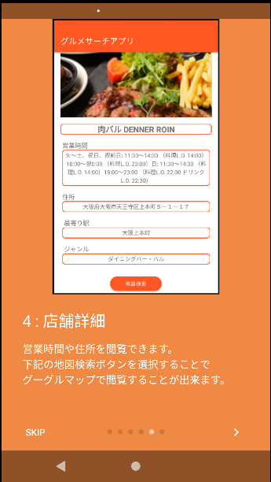
&emsp;

### 2. APIキーの入力
ウォークスルーが終了すると、ホットペッパーAPIキーの入力が求められます。
 ホットペッパーAPIを入手していない場合はブラウザを使ってホームページに飛ぶこともできます。
 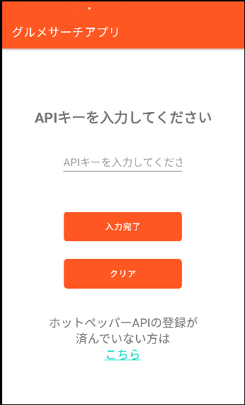
&emsp;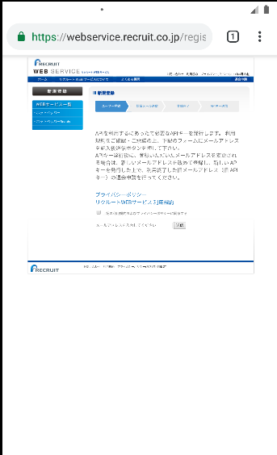

### 3. 検索範囲の選択
5つのボタンから、検索範囲の選択を行います。
 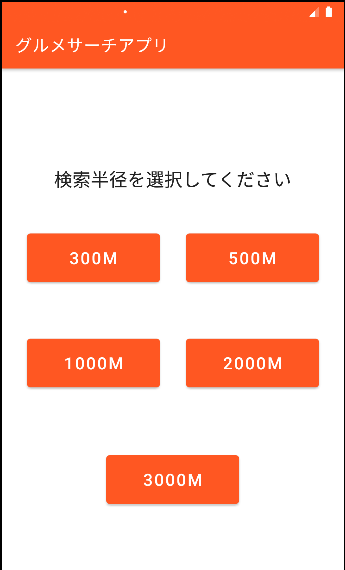

### 4. GPSの検索
GPSの検索を行います。
 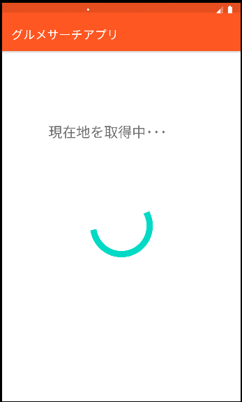

### 5. 店舗リストの表示
選択した検索条件から、周辺のレストランを探し、リストとして表示します。
  APIキーが間違っている場合や周辺にレストランが無い場合は、それぞれエラーメッセージを表示します。
 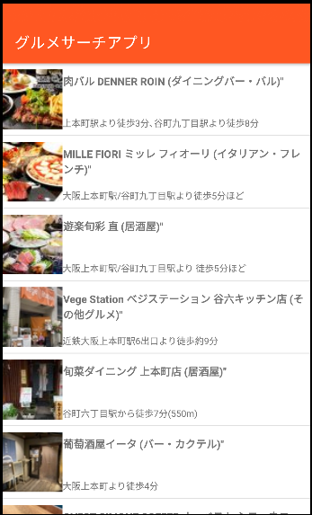
&emsp;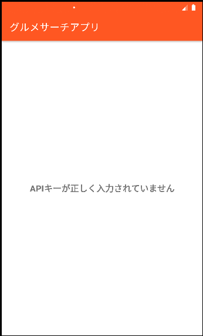
&emsp;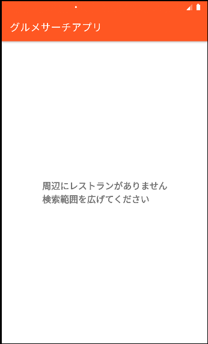

### 6. 店舗詳細の表示
リストから選択した店舗の詳細が表示されます。
 地図検索ボタンを押すと、住所が地図アプリに渡され、住所の地点が表示されます。
 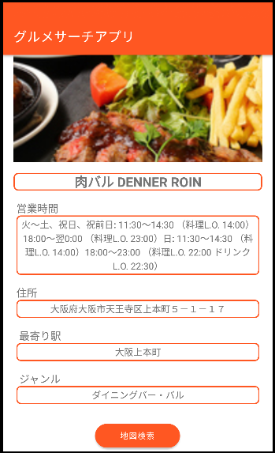
 
 
 ＊各画面の詳細は同フォルダ内の[簡易仕様書](https://github.com/masahiro-takakuwa/Gourmet_Search_App/blob/main/%E7%B0%A1%E6%98%93%E4%BB%95%E6%A7%98%E6%9B%B8.md)にあります。
